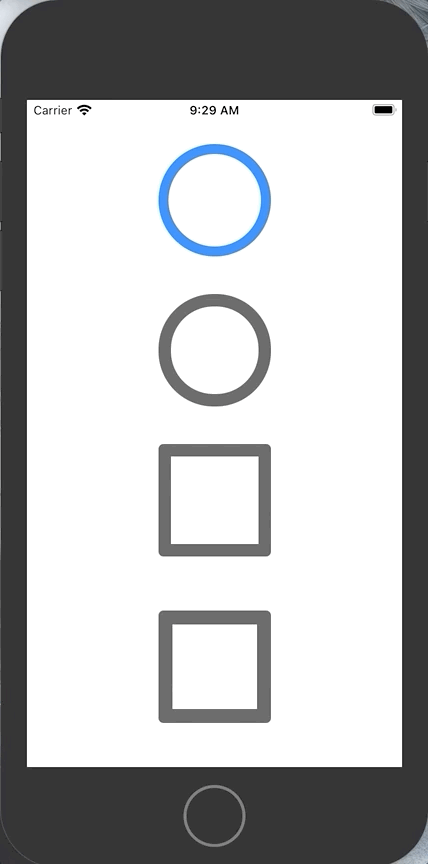

[](http://www.apache.org/licenses/LICENSE-2.0.html)

# UIButtonExtension

##preview


This package includes three components:

1. UIRadioButton
2. UICheckboxModern
3. UICheckboxClassic

## Usage
#### To install:
* Option 1: add `pod 'UIButtonExtension', '~> 0.2'` to your Podfile.

##### UIRadioButton

The `UIRadioButton` instance will have some attributes by default. you can customize these as you wish. to change the size of the button you only need to change the `height` of the instance.

to have the common Radio Button functionality where clicking one button disables the rest, you can relate these buttons inside an array by using a `relate` function.

```
let radioButton1 = UIRadioButton()
let radioButton2 = UIRadioButton()
let radioButton3 = UIRadioButton()

radioButton1.relate(otherUIRadioButtons: [radioButton2, radioButton3]) //now these three buttons are related and only one can be active at a time.
```
// add pic here

Since `UIRadioButton` is of type `UIView`, to use an `addTarget` method you have to use the `button`  inside the radioButton
```
let radioButton1 = UIRadioButton()

radioButton1.button.addTarget(self, action: #selector(example(_:)), for: .touchUpInside)
```

The `UIRadioButton` is made of two parts, the outer circle (which is of type `Button`) and the inner circle for when it's actively selected.
to customize aspects of the button you can use:
```
let radioButton = UIRadioButton()

radioButton.color = .red           //changes the color of the outer circle to red.
radioButton.selectedColor = .green //changes the color of the inner circle to green
radioButton.borderWidth = 5        //changes the width of the outer circle to 5
radioButton.cornerRadius = 20      //changes the cornerRadius of the button to 20. (no longer a circle)
radioButton.selectedSize = 0.8     //changes the ratio of the inner circle size to the outer circle, only available from 0 to 1
```
The `UIRadioButton` can take in string to show in 4 corners:
```
let radioButton = UIRadioButton()

radioButton.leftText(text: String)   // adds a label to the left of the button and adds the inserted
radioButton.rightText(text: String)  // adds a label to the right of the button and adds the inserted
radioButton.topText(text: String)    // adds a label to the top of the button and adds the inserted
radioButton.bottomText(text: String) // adds a label to the bottom of the button and adds the inserted
```

by default the text will have a dynamic font size which adapts to the `height` of the button and the default system `font` and `color`.
to change these you may use these:

```
let radioButton = UIRadioButton()

radioButton.fontSize = 25                            // change the size of the font
radioButton.font = UIFont(name: "Example", size: 20) // change the font of the text
radioButton.textColor = .blue                        // change the color of the text
```
Each instance of the `UIRadioButton` will have a randomly generated `id` (NSUUID) which you can change.
each instance is also animated by default.

```
let radioButton = UIRadioButton()

print(radioButton.id)          //prints the current radioButton id
radioButton.id = "lorem Ipson" //changes the radioButton id to "lorem Ipson"
radioButton.animate = false    //disables the selection animation
```
to understand the current status of the button to see wether it's selected or not you can use `isSelected`.
```
let radioButton = UIRadioButton()

if radioButton.isSelected == true {
    //do stuff here
}
```

### UICheckboxModern

The `UICheckboxModern` instance will have some attributes by default. you can customize these as you wish.
to change the size of the button you only need to change the `height` of the instance.
when clicked in modern style, the box gets filled by color and the checkmark resides inside the container box.
The `UICheckboxModern` is made of two parts, the containing box and the checkmark for when it's actively selected.
to customize aspects of the button you can use:
```
let checkboxModern = UICheckboxModern()

checkboxModern.color = .red           //changes the color of the containing box to red.
checkboxModern.selectedColor = .green //changes the color of the checkmark background to green
checkboxModern.borderWidth = 5        //changes the width of the containing box to 5
checkboxModern.checkedImage = UIImage(named: "how dare you change my default image.png") //changes the check mark image to what ever you like...
checkboxModern.cornerRadius = 5       //changes the corner radius of the containing box, can change value to make it a circle
```

The `UICheckboxModern` can take in `String` to show in 4 corners:

```
let checkboxModern = UICheckboxModern()

checkboxModern.leftText(text: String)   // adds a label to the left of the button and adds the inserted
checkboxModern.rightText(text: String)  // adds a label to the right of the button and adds the inserted
checkboxModern.topText(text: String)    // adds a label to the top of the button and adds the inserted
checkboxModern.bottomText(text: String) // adds a label to the bottom of the button and adds the inserted
```

by default the text will have a dynamic font size which adapts to the `height` of the button and the default system `font` and `color`.
to change these you may use these:
```
let checkboxModern = UICheckboxModern()

checkboxModern.fontSize = 25                            // change the size of the font
checkboxModern.font = UIFont(name: "Example", size: 20) // change the font of the text
checkboxModern.textColor = .blue                        // change the color of the text
```
Each instance of the `UICheckboxModern` will have a randomly generated `id` (NSUUID) which you can change.
each instance is also animated by default.
```
let checkboxModern = UICheckboxModern()

print(checkboxModern.id)          //prints the current checkboxModern id
checkboxModern.id = "lorem Ipson" //changes the checkboxModern id to "lorem Ipson"
checkboxModern.animate = false    //disables the selection animation
```
to understand the current status of the button to see wether it's selected or not you can use `isSelected`.
keep in mind that `isSelected` is a read only property and only changes when the button is pressed.
```
let checkboxModern = UICheckboxModern()

if checkboxModern.isSelected == true {
    //do stuff here
}
```

### UICheckboxClassic

The `UICheckboxClassic` instance will have some attributes by default. you can customize these as you wish.
to change the size of the button you only need to change the `height` of the instance.
when clicked in type 2, the check mark pops out of the frame a little to create it's unique visual style. keep in mind, if the width of the button is not the same as the height then the location of the checkmark will change based on the X axis.
The `UICheckboxClassic` is made of two parts, the containing box and the checkmark for when it's actively selected.
to customize aspects of the button you can use:
```
let checkboxClassic = UICheckboxClassic()

checkboxClassic.color = .red           //changes the color of the containing box to red.
checkboxClassic.selectedColor = .green //changes the color of the checkmark background to green
checkboxClassic.borderWidth = 5        //changes the width of the containing box to 5
checkboxClassic.checkedImage = UIImage(named: "how dare you change my default image.png") //changes the check mark image to what ever you like...
checkboxClassic.cornerRadius = 5       //changes the corner radius of the containing box, can change value to make it a circle
```
The `UICheckBoxClassic` can take in `String` to show in 4 corners:
```
let checkboxClassic = UICheckboxClassic()

checkboxClassic.leftText(text: String)   // adds a label to the left of the button and adds the inserted
checkboxClassic.rightText(text: String)  // adds a label to the right of the button and adds the inserted
checkboxClassic.topText(text: String)    // adds a label to the top of the button and adds the inserted
checkboxClassic.bottomText(text: String) // adds a label to the bottom of the button and adds the inserted
```
by default the text will have a dynamic font size which adapts to the `height` of the button and the default system `font` and `color`.
to change these you may use these:
```
let checkboxClassic = UICheckboxClassic()

checkboxClassic.fontSize = 25                            // change the size of the font
checkboxClassic.font = UIFont(name: "Example", size: 20) // change the font of the text
checkboxClassic.textColor = .blue                        // change the color of the text
```
Each instance of the `UICheckboxClassic` will have a randomly generated `id` (NSUUID) which you can change.
each instance is also animated by default.
```
let checkboxClassic = UICheckboxClassic()

print(checkboxClassic.id)          //prints the current checkboxClassic id
checkboxClassic.id = "lorem Ipson" //changes the checkboxClassic id to "lorem Ipson"
checkboxClassic.animate = false    //disables the selection animation
```
to understand the current status of the button to see wether it's selected or not you can use `isSelected`.
keep in mind that `isSelected` is a read only property and only changes when the button is pressed.
```
let checkboxClassic = UICheckboxClassic()

if checkboxClassic.isSelected == true {
    //do stuff here
}
```
# Contact me:
this is my first ever library, be gentle 😁

Email:        shadowofarman@hotmail.com

Twitter:      [@shadow_of_arman](https://twitter.com/shadow_of_arman)

Instagram: [shadowofarman](https://www.instagram.com/shadowofarman/)
